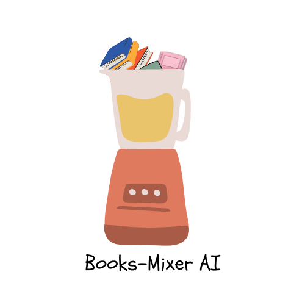

<h1 align="center">Books-Mixer AI</h1>
<h2 align="center">Mix and Twist Your Favorite Books!📖</h2>
<div align="center">
    
   
   
   
   
   <div>
        <a href="https://books-mixer-ai.vercel.app/"></a>
        <p><i>Books-Mixer AI logo</i></p>
   </div>
</div>

This project was built and shipped thanks to:

<div align="center">
    <a href="https://react.dev/"></a>
    <p><i>React.js</i></p>
    <br>
    <a href="https://vercel.com/"></a>
    <p><i>Vercel</i></p>
</div>

### User guide

#### 1. Understand the purpose of Books-Mixer AI

Books-Mixer AI is a web application that lets you mix the plots of two books based on your instructions and on the information it can retrieve about the books from Wikipedia.

#### 2. How it works 

Books-Mixer AI works on a very simple chat interface, in addition to which you have four text boxes, where you need to specify:
- the titles of the two books you want to mix
- your OpenAI API key
- your ModelsLab API keys (more on that in the [dedicated section](#3-get-your-api-keys))

You can then type your instructions for plot generation directly in the chat space.

#### 3. Get your API keys

To get your API keys:

- **OpenAI**: you need to [subscribe](https://openai.com/) to OpenAI services and then you can [login](https://platform.openai.com/docs/overview) to your personal dashboard where, under the **API keys** section, you will be able to get your personal key by clicking on `+ Create new secret key`.
- **ModelsLab**: you need to [sign up](https://modelslab.com/register) on ModelsLab platform and then, from the dashboard, just go to **API settings** and click on `Create new key`.

You just now have to copy them and paste in the dedicated text boxes on the app!🚀

### Developer guide

### Run the app locally

There are two ways you can play with the app locally:

#### 1. Docker image

You can pull the Docker image:

```bash
docker pull astrabert/books-mixer-ai:latest
```

And run it on port 3000:

```bash
docker run -p 3000:3000 astrabert/books-mixer-ai:latest
```

The app will be up and running on http://localhost:3000 in less than 30s.

#### 2. Source code

> ⚠️: _Ensure you have `npm` and `node` installed on your local machine!_

Clone the GitHub repository:

```bash
git clone Https://github.com/AstraBert/books-mixer-ai.git

cd books-mixer-ai
```

Install necessary packages:

```bash
npm install
```

After that, you should be able to make the application work by running:

```bash
npm start
```

The application should be running on http://localhost:3000 in less than a minute!😊

### Contribute

Follow the contribution guidelines you can find in [CONTRIBUTING.md](./CONTRIBUTING.md)

### Support the project

If you found this project useful and want it to keep being open source, consider funding it on [GitHub sponsors](https://github.com/sponsors/AstraBert).
