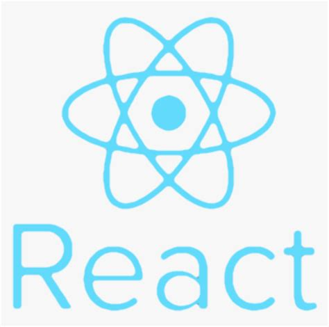

<h1 align="center">Books-Mixer AI</h1>
<h2 align="center">Mix and Twist Your Favorite Books!📖</h2>

    
   
   
   
   
   

        
        
<i>Books-Mixer AI logo</i>

   

This project was built and shipped thanks to:

    
    
<i>React.js</i>

     
    
    
<i>Vercel</i>

### ⚠️ Full documentation will be coming soon
